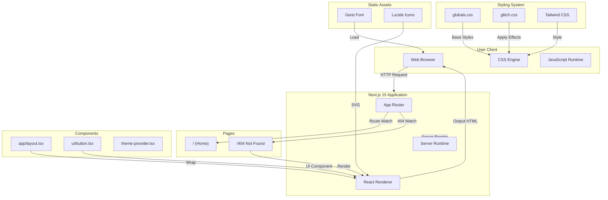
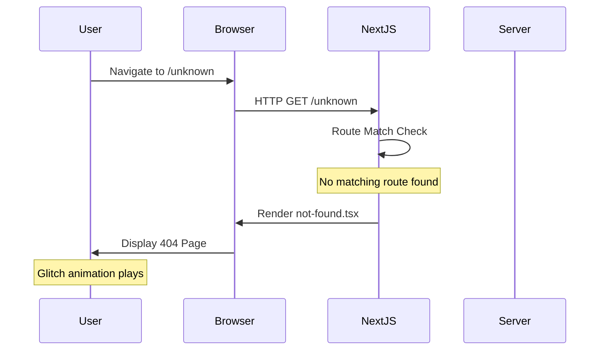

# 404 Not Found View

> A **stylish** and **modern** 404 error page built with **Next.js**, **React**, and **Tailwind CSS** featuring animated glitch effects

[](https://nextjs.org)
[](https://tailwindcss.com)
[](https://typescriptlang.org)

---

## Table of Contents

- [Overview](#overview)
- [Features](#features)
- [System Architecture](#system-architecture)
- [Tech Stack](#tech-stack)
- [Project Structure](#project-structure)
- [Getting Started](#getting-started)
- [Configuration](#configuration)
- [Statistics](#statistics)
- [Deployment](#deployment)
- [License](#license)

---

## Overview

This project is a **custom 404 Not Found error page** designed with a modern, creative aesthetic. It features:

- **Animated glitch effects** with RGB split technology
- **Scan line animation** for retro CRT feel
- **Floating particles** for depth and ambiance
- **Background grid pattern** for visual structure
- **Smooth micro-interactions** on hover states
- **Fully responsive** design for all devices

> **Tip**: The 404 page automatically renders when users navigate to non-existent routes in the Next.js application.

---

## Features

### Core Features

- **Glitch Text Animation** - RGB split effect with red and blue color offsets
- **Scan Line Effect** - Vertical scan line sweeping across the screen
- **Floating Particles** - Ambient floating dots for depth
- **Background Grid** - Subtle grid pattern for structure
- **Typewriter Effect** - Animated error code display
- **Blinking Cursor** - Retro terminal cursor animation
- **Status Indicator** - "DISCONNECTED" status with pulse animation

### UI/UX Features

- **Responsive Design** - Works perfectly on mobile, tablet, and desktop
- **Dark Theme** - Full black aesthetic with white/gray text
- **Smooth Transitions** - All hover states include smooth transitions
- **Two Action Buttons** - "Go Home" and "Go Back" navigation options

### Technical Features

- **Next.js 15 App Router** - Modern routing framework
- **Server Components** - Optimal performance with server rendering
- **CSS Modules** - Scoped styling with glitch.css
- **Tailwind CSS** - Utility-first styling approach
- **Type Safety** - Full TypeScript support

---

## System Architecture



### Request Flow



---

## Tech Stack

### Core Technologies

| Technology | Version | Purpose |
|------------|---------|---------|
| **Next.js** | 15.2.4 | React Full-Stack Framework |
| **React** | 19 | UI Library |
| **TypeScript** | 5.x | Type Safety |

### Styling & UI

| Technology | Version | Purpose |
|------------|---------|---------|
| **Tailwind CSS** | 3.4.17 | Utility-first CSS Framework |
| **Radix UI** | 1.2.2+ | Unstyled UI Primitives |
| **Lucide React** | 0.454.0 | Icon Library |
| **Geist** | 1.3.1 | Font Family |

### Utilities & Libraries

| Technology | Version | Purpose |
|------------|---------|---------|
| **class-variance-authority** | 0.7.1 | Component Variant System |
| **clsx** | 2.1.1 | Conditional Class Names |
| **tailwind-merge** | 2.5.5 | Tailwind Class Merging |
| **next-themes** | 0.4.4 | Dark/Light Mode Support |
| **zod** | 3.24.1 | Schema Validation |
| **react-hook-form** | 7.54.1 | Form Handling |

### Development Tools

| Technology | Version | Purpose |
|------------|---------|---------|
| **PostCSS** | 8.5 | CSS Processing |
| **Autoprefixer** | 10.4.20 | Vendor Prefixes |
| **@types/node** | 22 | Node.js Types |

---

## Project Structure

```
404-not-found-view/
├── app/                          # Next.js App Router
│   ├── layout.tsx                # Root layout (imports glitch.css)
│   ├── page.tsx                  # Home page
│   ├── not-found.tsx            # 404 error page
│   ├── globals.css              # Global Tailwind styles
│   └── glitch.css              # Glitch animations & effects
├── components/
│   └── ui/                       # UI Components
│       ├── button.tsx           # Button component
│       └── theme-provider.tsx   # Theme provider
├── lib/
│   └── utils.ts                  # Utility functions
├── public/                       # Static assets
│   ├── placeholder.svg
│   ├── placeholder.jpg
│   ├── placeholder-user.jpg
│   └── placeholder-logo.svg
├── tailwind.config.ts          # Tailwind configuration
├── next.config.mjs            # Next.js configuration
├── postcss.config.mjs         # PostCSS configuration
├── tsconfig.json              # TypeScript configuration
├── package.json              # Dependencies
└── README.md                 # This file
```

---

## Getting Started

### Prerequisites

Before starting, ensure you have:

- **Node.js** 18.x or later
- **npm** 9.x or later (or pnpm/yarn)
- **Git** for cloning the repository

### Installation Step by Step

```bash
# 1. Clone the repository
git clone https://github.com/girishlade111/404-not-found-view.git

# 2. Navigate to project directory
cd 404-not-found-view

# 3. Install dependencies
npm install

# 4. Start development server
npm run dev
```

### Development Commands

| Command | Description | Output |
|--------|-------------|--------|
| `npm run dev` | Start development server | `http://localhost:3000` |
| `npm run build` | Build for production | `.next/` directory |
| `npm run start` | Start production server | `http://localhost:3000` |
| `npm run lint` | Run ESLint | Console output |

---

## Configuration

### Tailwind CSS Configuration

Located in `tailwind.config.ts`:

```typescript
{
  darkMode: ['class'],
  content: ['./app/**/*', './components/**/*'],
  theme: {
    extend: {
      colors: {
        background: '...',
        foreground: '...',
        primary: '...',
        // ... custom colors
      },
      borderRadius: {
        lg: '...',
        md: '...',
        sm: '...',
      },
    },
  },
  plugins: [require('tailwindcss-animate')],
}
```

### Next.js Configuration

Located in `next.config.mjs`:

```javascript
{
  eslint: { ignoreDuringBuilds: true },
  typescript: { ignoreBuildErrors: true },
  images: { unoptimized: true }
}
```

### Glitch Effects (glitch.css)

The 404 page uses these CSS animations:

- `.glitch-text` - Main glitch animation
- `.glitch-red` / `.glitch-blue` - RGB split effect
- `.scan-line` - Vertical scan line
- `.particle` - Floating particles
- `.bg-grid` - Background grid pattern
- `.typewriter` - Typewriter text effect
- `.blink` - Blinking cursor

> **Note**: `glitch.css` is imported in `app/layout.tsx` to ensure it's loaded globally.

---

## Statistics

| Metric | Value |
|--------|-------|
| **Total Dependencies** | 240+ packages |
| **Production Dependencies** | ~50 packages |
| **Dev Dependencies** | ~6 packages |
| **UI Components** | Radix UI primitives (~30+) |
| **Bundle Size** | Optimized via Next.js |
| **Lines of CSS** | 450+ lines |
| **Animation Keyframes** | 15+ keyframe definitions |

---

## Deployment

### Build for Production

```bash
# Run the build command
npm run build

# Output will be in .next/ directory
```

### Deploy to Any Platform

This project can be deployed to **any platform** that supports Node.js:

| Platform | Deployment Command |
|----------|------------------|
| **Vercel** | `vercel deploy` |
| **Netlify** | `netlify deploy` |
| **Railway** | `railway deploy` |
| **Render** | `render deploy` |
| **Fly.io** | `fly deploy` |
| **Custom Server** | `npm run start` |

### Environment Variables

> **No environment variables required** for basic setup.

---

## License

> **MIT License** - Feel free to use this project for your own applications.

---

## Support

- **Next.js Docs**: [https://nextjs.org/docs](https://nextjs.org/docs)
- **Tailwind CSS**: [https://tailwindcss.com](https://tailwindcss.com)
- **Report Issues**: [GitHub Issues](https://github.com/girishlade111/404-not-found-view/issues)

---

## Contributing

Contributions are welcome! Please feel free to submit a **Pull Request**.

---

**Built by Girish Lade** — [github.com/girishlade111](https://github.com/girishlade111) · [ladestack.in](https://ladestack.in)